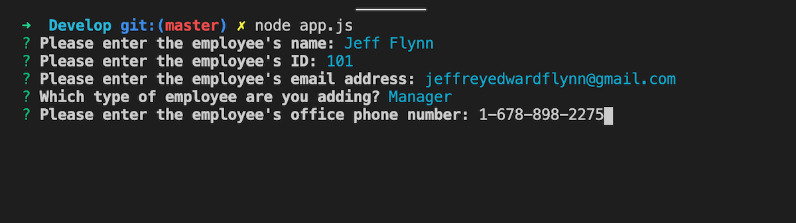
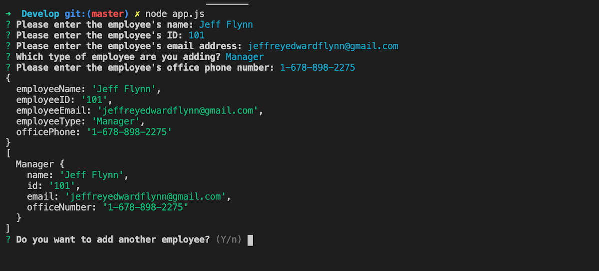
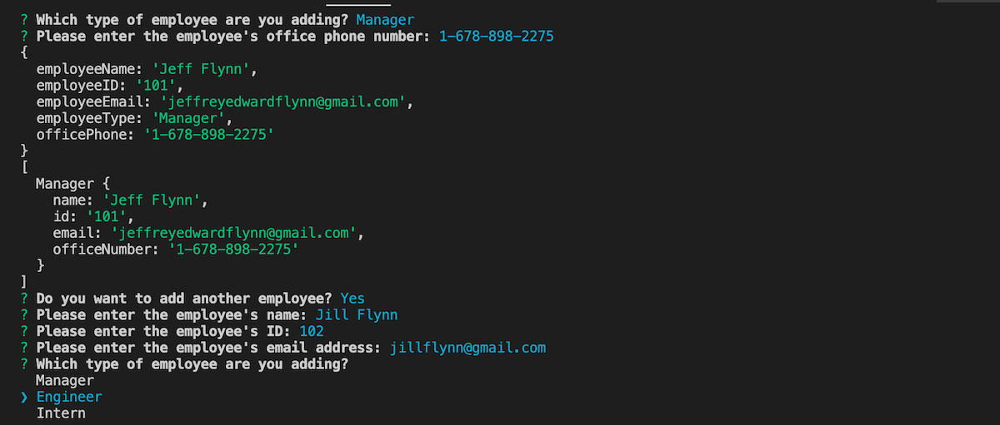
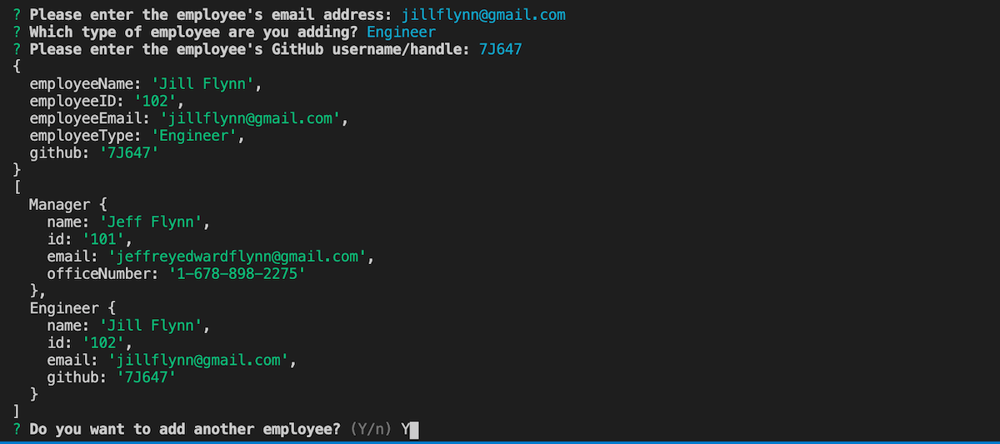
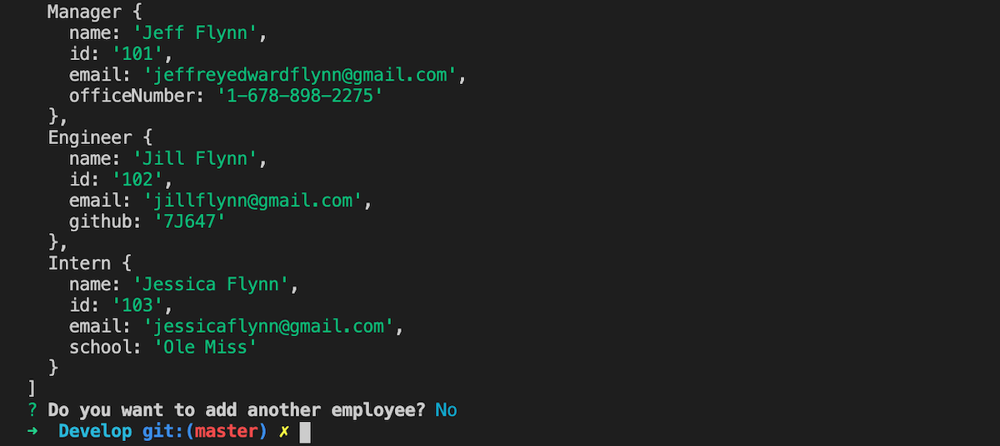
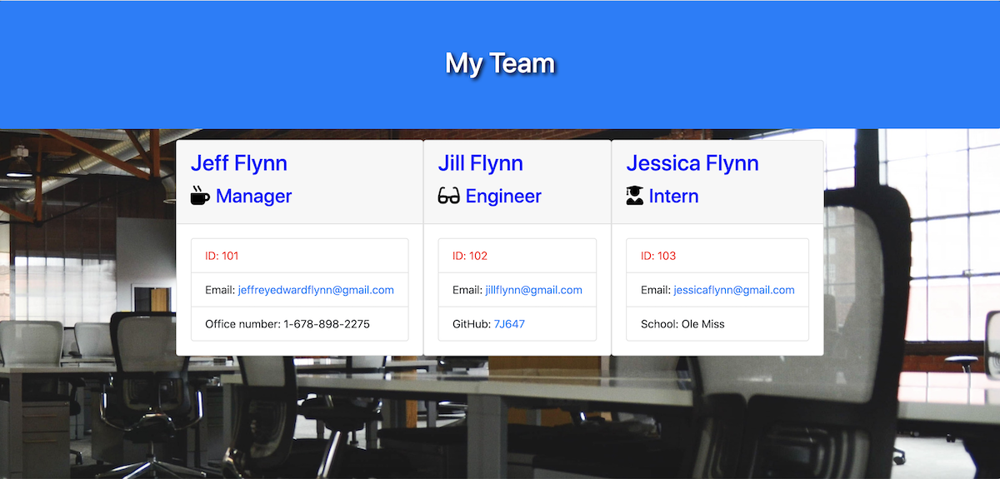

# Template-Engine---Employee-Summary

## Table of Contents
#### &nbsp;&nbsp;&nbsp;&nbsp;[1)&nbsp;Introduction](#introduction)
#### &nbsp;&nbsp;&nbsp;&nbsp;[2)&nbsp;Description](#description)
#### &nbsp;&nbsp;&nbsp;&nbsp;[3)&nbsp;Features](#features)
#### &nbsp;&nbsp;&nbsp;&nbsp;[4)&nbsp;Usage](#Usage-including-GitHub-Repository-URL-and-screenshots)
#### &nbsp;&nbsp;&nbsp;&nbsp;[5)&nbsp;Contributing](#contributing)
#### &nbsp;&nbsp;&nbsp;&nbsp;[6)&nbsp;License](#license)
#### &nbsp;&nbsp;&nbsp;&nbsp;[7)&nbsp;Questions](#questions)
    
## Introduction 

A basic but very important aspect of programming is simply being sure that the code being written is readable, reliable, and maintainable.  A key part in making code maintainable is testing.  This project involved building a Node CLI that accepts input from a team leader about employees and then generates an HTML webpage displaying summaries for each of them while making sure that all unit tests pass.

The user story for this project is a manager who wants to quickly generate a webpage displaying their team's basic info, so that the manager can have quick access to information like emails, GitHub profiles, and the schools that the team interns attend.  

## Description

This team generator runs from the command line and starts by prompting the user for general employee information.  After a few questions that apply to all classes of employees, there is a "branch" to a class-specific question that is different depending on which class of employee is being generated: Manager, Engineer, or Intern.

When a user has finished generating the information for the team, the application writes a custom HTML file displaying this formatted information in a custom-styled manner.  Before any code was written though a total of 14 tests needed to pass.  Because tests must be set up to initially fail, the tests were written before the code.  Tests were looked at one at a time and the code was written to pass before moving on to the next one.

## Features

A series of inquirer.prompt questions were generated with the main problem to solve being how to handle the class-specific question that differed for each type of employee.  This was solved through internet research and the discovery of a "when" function that can be included inside each question array.  "When" a specific employee role was selected, the custom question for that role was generated.  This was accomplished without having to nest functions.

From there the user input is pushed into an Employees array and through starter code already provided this information was written into a team.html file that joined it all together.  The template pages were able to be styled so that some basic Bootstrap CSS jumbotron and card elements could be customized.  A style.css file was linked which was able to style the text and add a background image.

As a bonus we were asked to include this project in our updated portfolio and to accommplish this an index.html file needed to be created with an updated css link to reflect a relative path in the root of the directory.  Once an index.html file was included the project could then be uploaded to a Github URL.

## Usage including GitHub Repository URL and screenshots

To use this app, a user needs to go its GitHub repository and clone it into a folder on their own computer.  Once the folder is opened it is run from the command line beginning with "node app.js" as referenced.

<a href="https://github.com/7J647/Template-Engine---Employee-Summary">Click here to view this project's GitHub repository</a>

<a href="https://7j647.github.io/Template-Engine---Employee-Summary/">Click here to view the HTML output</a>

 

<a href="https://drive.google.com/file/d/1hZIgYySCZwzr-OFWstZxzuTDh90j_tvx/view">Click here to view a demonstration video</a> 

## Contributing

With thanks to instructor Jonathan Watson and his team of TAs (especially Phil!), and to Josh Furlin for 
providing tutoring on this project.

## License

MIT License

Copyright (c) 2020 Jeff Flynn

Permission is hereby granted, free of charge, to any person obtaining a copy
of this software and associated documentation files (the "Software"), to deal
in the Software without restriction, including without limitation the rights
to use, copy, modify, merge, publish, distribute, sublicense, and/or sell
copies of the Software, and to permit persons to whom the Software is
furnished to do so, subject to the following conditions:

The above copyright notice and this permission notice shall be included in all
copies or substantial portions of the Software.

THE SOFTWARE IS PROVIDED "AS IS", WITHOUT WARRANTY OF ANY KIND, EXPRESS OR
IMPLIED, INCLUDING BUT NOT LIMITED TO THE WARRANTIES OF MERCHANTABILITY,
FITNESS FOR A PARTICULAR PURPOSE AND NONINFRINGEMENT. IN NO EVENT SHALL THE
AUTHORS OR COPYRIGHT HOLDERS BE LIABLE FOR ANY CLAIM, DAMAGES OR OTHER
LIABILITY, WHETHER IN AN ACTION OF CONTRACT, TORT OR OTHERWISE, ARISING FROM,
OUT OF OR IN CONNECTION WITH THE SOFTWARE OR THE USE OR OTHER DEALINGS IN THE
SOFTWARE.

## Questions

Connect with me at Github: <a href="https://github.com/7J647">7J647</a> &nbsp;&nbsp;&nbsp;&nbsp;
Contact me via Email: [jeffreyedwardflynn@gmail.com](mailto:jeffreyedwardflynn@gmail.com)
 